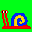

## Table of Contents

- Will be replaced with the ToC, excluding the "Contents" header
{:toc}

## Links

- [GIMP plugin](https://github.com/pannacotta98/ogniewski-scaler)

## Images (Work in Progress)

Click on the images...

### Figure ?: Snail
<small>Figure caption here stuffs</small>

### Figure ?
<small>SSIM, PSNR and S-CIELAB results of upscaling in different color spaces presented as box plots. Ten Images were upscaled in six different color spaces. SSIM: Higher value indicates better quality. PSNR: Higher value indicates better quality. S-CIELAB: Lower mean error indicates better quality.</small>

### Appendix ?: Many images
<small>Testsetsliet</small>

#### HSV

#### Also HSV

